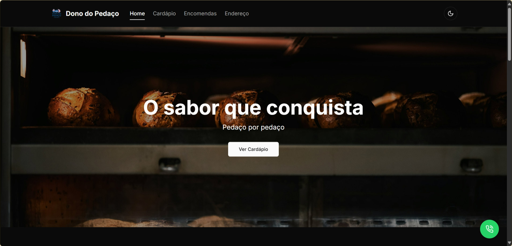
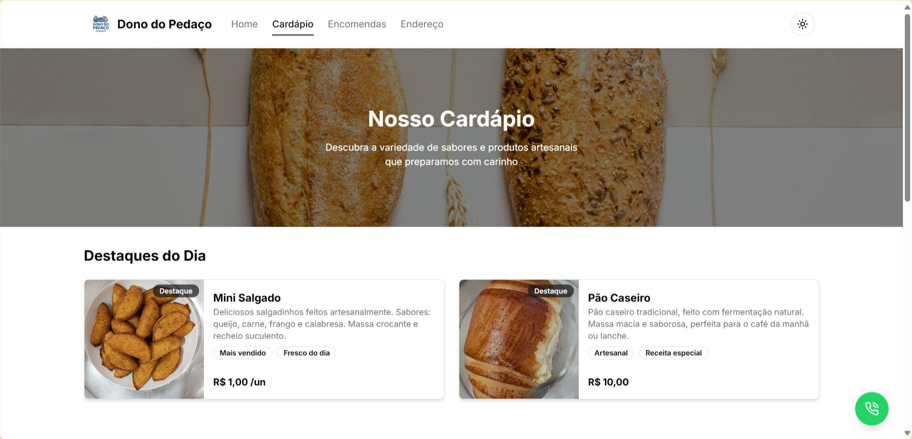

# Dono do Pedaço

Aplicação web desenvolvida com Next.js para uma padaria local, implementando um sistema de cardápio digital e gerenciamento de encomendas.

## Sobre o Projeto

O Dono do Pedaço é uma padaria artesanal que oferece uma variedade de produtos frescos e de qualidade. Este site foi desenvolvido para:

- Apresentar cardápio de produtos
- Facilitar o processo de encomendas
- Fornecer informações de contato e localização
- Oferecer uma experiência de usuário moderna e agradável

## Funcionalidades

- **Cardápio Digital**: Apresentação dos produtos organizados por categorias (pães, doces, salgados e outros)
- **Sistema de Encomendas**: Formulário integrado para pedidos de bolos e salgados
- **Informações de Contato**: Endereço, horário de funcionamento e canais de comunicação
- **Design Responsivo**: Interface adaptável para todos os dispositivos
- **Tema Claro/Escuro**: Opção de alternar entre temas para melhor conforto visual

## Stack

- Next.js 14
- TypeScript
- Tailwind CSS
- Shadcn/ui
- React Hook Form

## Estrutura

```
/app                # Rotas e páginas da aplicação
  /components       # Componentes reutilizáveis
  /hooks           # Custom hooks
  /lib             # Utilitários e configurações
  /styles          # Estilos globais e temas
```

## Screenshots

### Página Inicial


### Página do Cardápio


## Como Executar

```bash
# Instalar dependências
npm install

# Rodar em desenvolvimento
npm run dev

# Build para produção
npm run build
```

Acesse `http://localhost:3000` no seu navegador.